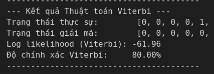
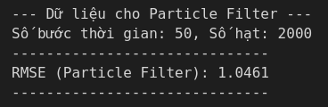

# Bài thực hành 2 Time series

## 1. Giới thiệu đề tài
So sánh hiệu suất giữa bộ lọc Kalman, bộ lọc Particle và thuật toán Viterbi
## 2. Ý tưởng
**Tạo bộ dữ liệu** cho mỗi thuật toán để chạy thực nghiệm từ đó đánh giá **hiệu suất, ưu nhược điểm** của từng thuật toán trong các ứng dụng cụ thể
## 3. Chạy thực nghiệm
Cài các thư viện cần thiết
```
pip install -r requirements.txt
```
Chạy file [code.ipynb](./code/code.ipynb)
## 4. Kết quả
### 4.1 Thuật toán Viterbi
- Độ chính xác đạt 80%
- 
- 
### 4.2 Bộ lọc kalman
- RSME là 0.43
- 
- 
### 4.3 Bộ lọc particle
- RSME chi có 1.05
- 
- 